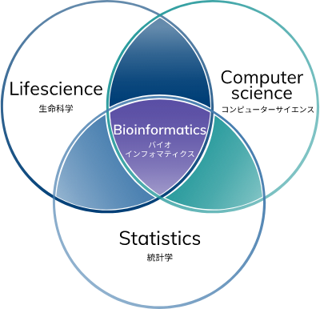

# Bioinformatics 
Bioinformatics is the application of computer technology to the understanding and effective use of biological and biomedical data.

Biology is the study of life and living organisms.

### Bioinformatics Components

### Big Data
- Genes ->  Genomics
- Proteins -> Protenomics
- Sugar -> Glycomics
- Lipids -> Lipidomics
- Metabolites -> Metabolomics
- Molecular interactions -> Interactomics

### Precision medicine
Precision medicine looks at the genetics, environment, and lifestyle of a person in order to select treatment that could work best for them.

---

Status: #Draft

Tags:
[[Bioinformatics]] | [[Big data]] | [[Precision medicine]]

Links:

References:

