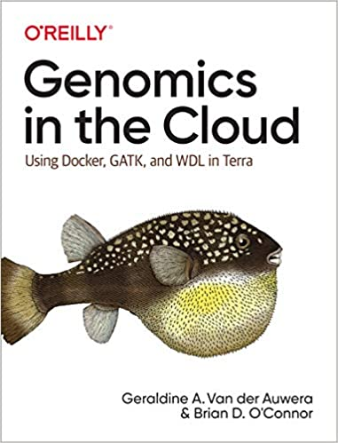
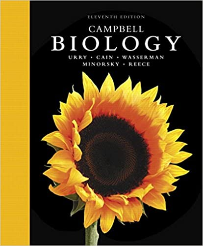

# Bioinformatics Books

### Genomics in the Cloud: Using Docker, GATK, and WDL in Terra
The practical book, researchers will learn how to work with genomics algorithms using open source tools including the Genome Analysis Toolkit (GATK), Docker, WDL, and Terra.

### Campbell Biology
_Campbell BIOLOGY_ is the unsurpassed leader in introductory biology.

---

Status: #Draft

Tags:
[[Bioinformatics]] | [[Book]] 

Links:

References:

