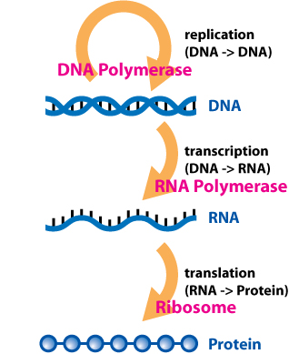

>[!note] Definition
>The flow of genetic information within a biological system. DNA (transcription) → RNA (translation)→ protein

>[!example]+ 日本語
> [[セントラルドグマ]] 

>[!info]+ RELATED TERMS
> [[DNA]] → [[RNA]] → [[protein]]

>[!faq]+ IMAGE
> 

_____
