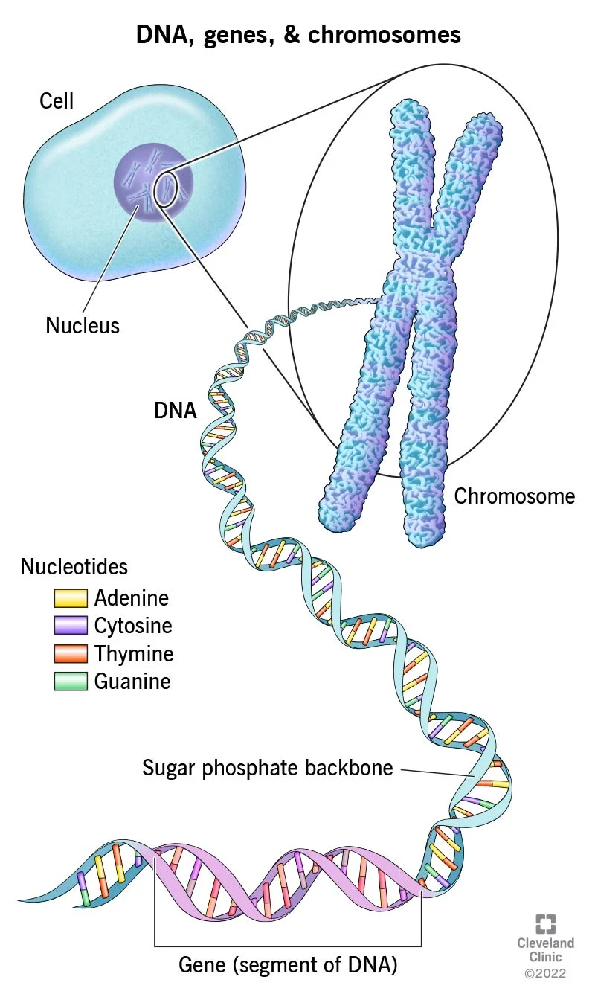

>[!note] Definition
>Sections of DNA that code individual proteins.>

>[!example]+ 日本語
> [[遺伝子]] （いでんし）

>[!info]+ RELATED TERMS
> [[genome]]
> [[cell]] → [[nucleus]] → [[chromosome]] → [[DNA]] → [[gene]]

>[!faq]+ IMAGE
> 

_____
