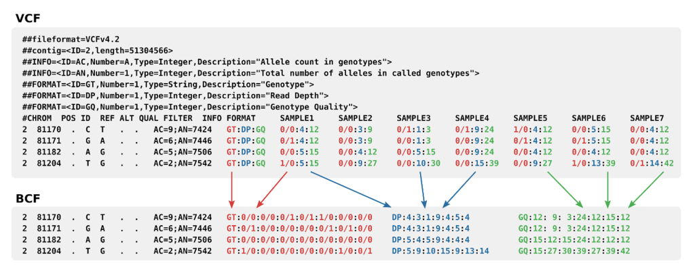

## Squence Data
- 3 major types of data
1. Sequence data - FASTA, FASTQ
2. Alignment data - SAM, BAM, CRAM
3. Genome feature data - BED, Wiggle, GTF, GFF

#### Process
Genome Alignment
Using human reference genome to align position
FASTG -> BAM

Variance detection
- Around 4-5 million differences to reference genome
BAM -> VCF 

#### FASTA file
- A FASTA file  is a text-based format for representing either nucleotide sequences or amino acid (protein) sequences.
- FASTQ – FASTA with quality
- Each entry in a FASTQ files consists of 4 lines:
  1. A sequence identifier with information about the sequencing run and the cluster. The exact contents of this line vary by based on the BCL to FASTQ conversion software used.
  2. The sequence (the base calls; A, C, T, G and N).
  3. A separator, which is simply a plus (+) sign.
  4. The base call quality scores. These are Phred +33 encoded, using ASCII characters to represent the numerical quality scores.
- FASTA file extensions: fasta, fa, faa, ffn, fnn, fna (.gz, .bgz, .bze, .xz)
- FASTQ file extensions: fastq, fq (.gz, .bgz, .bz2, .xz)

- FASTA sample data

- FASTQ sample data
- Reads 150 pairs
- Genome coverage at 30X yields 99.9% accuracy

#### SAM file
- SAM stands for Sequence Alignment Map format. 
- It is a TAB-delimited text format consisting of a header section, which is optional, and an alignment section.
- Each header line begins with the character ‘@’.
- Each alignment line has 11 mandatory fields.
- BAM is binary compressed version of SAM file.
- CRAM files are smaller by taking advantage of an additional external "reference sequence" file.
- File extensions: .sam, .bam, .cram (.gz, .bgz, .bz2, .xz)

Header (optional)
| Col | Field | Brief description   |
| --- | ----- | ------------------- |
| 1   | @HD   | File-level metadata |
| 2   | @SQ   | Reference sequence dictionary       |
| 3   | @RG   | Read group                    |
| 4   | @PG   | Program                    |
| 5    | @CO      |  One-line text comment                   |

Alignment
| Col | Field | Type   | Brief description                     |
| --- | ----- | ------ | ------------------------------------- |
| 1   | QNAME | String | Query template NAME                   |
| 2   | FLAG  | Int    | bitwise FLAG                          |
| 3   | RNAME | String | Reference sequence NAME               |
| 4   | POS   | Int    | 1-based leftmost mapping POSition     |
| 5   | MAPQ  | Int    | MAPping Quality                       |
| 6   | CIGAR | String | CIGAR string                          |
| 7   | RNEXT | String | Reference name of the mate/next read  |
| 8   | PNEXT | Int    | Position of the mate/next read        |
| 9   | TLEN  | Int    | observed Template LENgth              |
| 10  | SEQ   | String | segment SEQuence                      |
| 11  | QUAL  | String | ASCII of Phred-scaled base QUALity+33 |

- SAM sample data

Ref: https://samtools.github.io/hts-specs/SAMv1.pdf

Human base pairs is 3.2 billion with 20,000 human genes
Human has 50 trillion cells
All of the cells in your body started from a single cell and contain  same DNA.
_Some exceptions are:_
 - 1) Mature red blood cells which contain no DNA
 - 2) The sperm and the egg that have half the amount of DNA
 - 3) B cells in which some of the DNA has been rearranged to make antibodies.

#### VCF file
- VCF stands for Variant Call Format. 
- a text file used in bioinformatics for storing gene sequence variations. 
- Header
- Columns
- VCF extesions: vcf  (.gz, .bgz, .bz2, .xz)
- VCF / BCF sample data

#### BCF file
BCF extesions: bcf  (.gz, .bgz)

#### GVF file
GVF extesions: gvf  (.gz, .bgz, .bz2, .xz)

## Sequencing Bioinformatics Pipeline

[[DNA-data-pipeline]]

---
## Tools

-   [SAMtools](http://samtools.sourceforge.net/) (and associated [publication](http://bioinformatics.oxfordjournals.org/content/25/16/2078.full))
-   [pysam](http://code.google.com/p/pysam/) (Python library)
-   [Picard](http://picard.sourceforge.net/) (Java library)
-   [Bamtools](http://sourceforge.net/projects/bamtools/) (C++ library)
-   [Rsamtools](http://www.bioconductor.org/packages/2.14/bioc/html/Rsamtools.html) (R library)

### pysam
- Pysam is a wrapper of the [htslib](http://www.htslib.org/) C-API and provides facilities to read and write SAM/BAM/VCF/BCF/BED/GFF/GTF/FASTA/FASTQ files as well as access to the command line functionality of the [samtools](http://samtools.sourceforge.net/) and [bcftools](https://samtools.github.io/bcftools/bcftools.html) packages.

- Github: https://github.com/pysam-developers/pysam
- Docs: https://pysam.readthedocs.io/en/latest/
