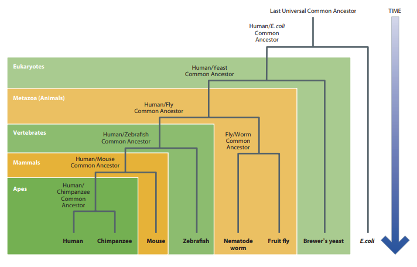
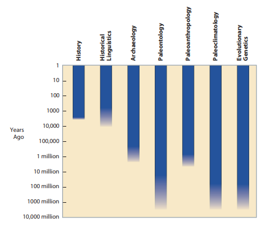
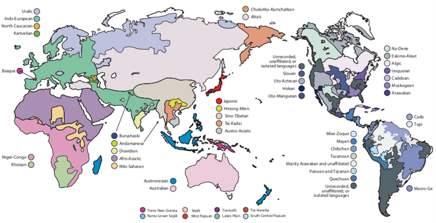

# HUMAN EVOLUTIONARY GENETICS
second edition

Mark Jobling 
Edward Hollox 
Matthew Hurles 
Toomas Kivisild 
Chris Tyler-Smith

---

## PREFACE
- Revised edition of Human Evolutionary Genetics, first published in 2004
- Two extra chapters: reflecting developments in understanding the human genome in the context of other hominid genomes, and in complex disease.
- 5 sections
  - Chapters 2–4: How do we study genome diversity? 
  - Chapters 5–6: How do we interpret genetic variation?
  - Chapters 7–9: Where and when did humans originate?
  - Chapters 10–14: How did humans colonize the world?
  - Chapters 15–18: How is an evolutionary perspective useful?
- New features:
 -  Opinion Boxes: short contributions by guest authors (experts).
 - Additional resources:  bibliography, electronic references, glossary, questions

---

## CONTENTS

- Chapter1:   An Introduction to Human Evolutionary Genetics
- Chapter2:   Organization and Inheriatance of the Human Genome
- Chapter3:   Human Genome Variation
- Chapter4:   Finding and Assaying Genome Diversity
- Chapter5:   Processes Shaping Diversity
- Chapter6:   Making Inferences from Diversity
- Chapter7:   Humans as Apes
- Chapter8:   What Genetic Changes Have Made Us Human?
- Chapter9:   Origins of Modern Humans
- Chapter10: The Distribution of Diversity
- Chapter11: The Colonization of the Old World and Australia
- Chapter12: Agricultural Expansions
- Chapter13: Into New-Found Lands
- Chapter14: What Happens When Populations Meet
- Chapter15: Understanding the Past, Present, and Future of Phenotypic Variation
- Chapter16: Evolutionary Insights into Simple Genetic Diseases
- Chapter17: Evolution and Complex Disease
- Chapter18: Identity and Identification
- Appendix
- Glossary
- Index

---

## AN INTRODUCTION TO HUMAN EVOLUTIONARY GENETICS

#### 1.1 WHAT IS HUMAN EVOLUTIONARY GENETICS?
- Evolutionary genetics is founded on the principle that the genetic record of life is contained in the [[genome]]s of living species and it reveals evolutionary processes and relationships all the way back to the last universal common ancestor of all species.
- Two developments
  - The public availability of human and nonhuman genome sequences
  - Technology as the tools to analyze huge datasets
- Different layers of the past are accessible through the analysis of genetic diversity.
- The past is the source of the present

- Time line of important developments in the field of human evolutionary genetics.
|Year|Developments|
|:----|:----|
|1786|Recognition of language families|
|1856|Discovery of Neanderthal type specimen|
|1859|Publication of Darwin’s “The Origin of Species”|
|1866|Publication of Mendel’s “Experiments in Plant Hybrids”|
|1871|Publication of Darwin’s “The Descent of Man”|
|1900|Discovery of first genetic polymorphism—ABO blood group (Landsteiner)|
|1908|Hardy–Weinberg principle formulated|
|1918|Fisher reconciles Darwin’s natural selection and Mendel’s mechanism of inheritance|
|1925|Australopithecus fossil described from South Africa|
|1930–32|Fisher, Haldane & Wright publish the foundations of modern population genetics|
|1944|DNA shown to be heritable material|
|1949|Radiocarbon dating introduced|
|1953|Double-helical structure of DNA described|
|1956|Human chromosome number described|
|1957|Hemoglobin amino acid sequences determined|
|1959|Y chromosome shown to be sex-determining|
|1966|Genetic code deciphered|
|1968|Neutral theory of molecular evolution (Kimura)|
|1969|Internet first successfully tested|
|1977|Publication of DNA sequencing methods|
|1978|First human restriction fragment length polymorphisms (RFLPs) described|
|1978|First human in vitro fertilization|
|1980|First genome (φX174 bacteriophage) sequenced|
|1981|Human mitochondrial DNA (mtDNA) genome sequenced|
|1984|DNA fingerprinting (minisatellites) discovered|
|1984|DNA-DNA hybridization shows human–chimpanzee common ancestry|
|1985|Invention of polymerase chain reaction (PCR)|
|1985|First human ancient DNA results published|
|1985|First Y-chromosomal polymorphism described|
|1987|Development of laser-induced fluorescent detection of DNA|
|1987|African origin of human mtDNA identified|
|1988|Launch of Human Genome Project|
|1989|Development of capillary electrophoresis for sequencing|
|1990|First human microsatellites described|
|1991|Human Genome Diversity Project proposed|
|1994|Publication of “The History and Geography of Human Genes” (Cavalli-Sforza et al.)|
|1996|First mammal cloned from adult cell (Dolly)|
|1997|First Neanderthal mtDNA sequence|
|1999|First human chromosome sequenced (Chr 22)|
|2001|Release of draft human genome sequence|
|2002|Release of draft mouse and Plasmodium genome sequences|
|2002|Human Genome Diversity Project (HGDP) Cell Line Panel released|
|2004|First maps of copy-number variation published|
|2005|First-generation human Haplotype Map (HapMap) published|
|2005|Release of draft chimpanzee genome sequence|
|2005|First development of next-generation sequencing methods|
|2006|1 Mb of Neanderthal genomic sequence published|
|2007|First large-scale genomewide association studies|
|2007|First personal human genome resequenced (Venter)|
|2007|Second-generation human Haplotype Map (HapMap) published|
|2009|Exome capture and sequencing methods published|
|2010|Denisovan mtDNA and genome sequences published|
|2010|1000 Genomes Project pilot study published|
|2012|All great ape genomes now sequenced|

A phylogenetic tree relates different branches of modern species, showing that they are all equally derived from their common ancestors in terms of time.

- By identifying segments of DNA that are more similar between the two species than could be expected by chance, we can identify regions whose evolution has been constrained by the need to perform a specific function. Some of these regions are genes.

- Understanding evolutionary history is essential to understanding human biology today. Why is the present like it is?

- Understanding evolutionary history shapes our expectations about the future. An evolutionary perspective on human genetic variation also allows us to make predictions, both about biological research, and about the future of our species.
- Phenotypic traits of humans are controlled by a combination of inherited and environmental factors, and stochastic developmental and molecular processes.

COMPLEMENTARY RECORDS OF THE HUMAN PAST
- Different types of evidence available
- The **historical** record comprises written texts: 4,000 years ago

- Spoken languages retain evidence of their origins over thousands of years.
- Many of these languages can be traced to a number of ancestral languages known as proto-languages.

- The **archaeological** record consists of physical objects that have been shaped by human contact. These include not only tools, ornaments, and pottery, but also soils, waste deposits, houses, and landscapes. The earliest recognizable stone tools date from about 2.5 million years ago (MYA). 
- The **paleontological** record comprises the fossilized remains of living organisms or their traces, such as preserved footprints. The earliest microfossils are suggested to date from 3500 MYA.

- Understanding chronology allows comparison of evidence from different scientific approaches

---

Status: #Draft

Tags:
[[Dictionary/Bioinfo dictionary/Med roots/bioinformatic]] |

Links:

References: