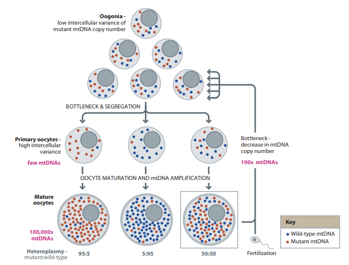
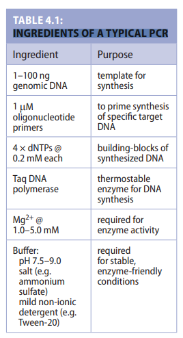

# HUMAN EVOLUTIONARY GENETICS 
# 2nd  edition
# SUMMARY

Mark Jobling 
Edward Hollox 
Matthew Hurles 
Toomas Kivisild 
Chris Tyler-Smith

---

## PREFACE
- Revised edition of Human Evolutionary Genetics, first published in 2004
- Two extra chapters: reflecting developments in understanding the human genome in the context of other hominid genomes, and in complex disease.
- 5 sections
  - Chapters 2–4: How do we study genome diversity? 
  - Chapters 5–6: How do we interpret genetic variation?
  - Chapters 7–9: Where and when did humans originate?
  - Chapters 10–14: How did humans colonize the world?
  - Chapters 15–18: How is an evolutionary perspective useful?
- New features:
 -  Opinion Boxes: short contributions by guest authors (experts).
 - Additional resources:  bibliography, electronic references, glossary, questions

---

## CONTENTS

- Chapter1:   An Introduction to Human Evolutionary Genetics
- Chapter2:   Organization and Inheriatance of the Human Genome
- Chapter3:   Human Genome Variation
- Chapter4:   Finding and Assaying Genome Diversity
- Chapter5:   Processes Shaping Diversity
- Chapter6:   Making Inferences from Diversity
- Chapter7:   Humans as Apes
- Chapter8:   What Genetic Changes Have Made Us Human?
- Chapter9:   Origins of Modern Humans
- Chapter10: The Distribution of Diversity
- Chapter11: The Colonization of the Old World and Australia
- Chapter12: Agricultural Expansions
- Chapter13: Into New-Found Lands
- Chapter14: What Happens When Populations Meet
- Chapter15: Understanding the Past, Present, and Future of Phenotypic Variation
- Chapter16: Evolutionary Insights into Simple Genetic Diseases
- Chapter17: Evolution and Complex Disease
- Chapter18: Identity and Identification
- Appendix
- Glossary
- Index

---

### AN INTRODUCTION TO HUMAN EVOLUTIONARY GENETICS
---

#### 1.1 WHAT IS HUMAN EVOLUTIONARY GENETICS?
- Evolutionary genetics is founded on the principle that the genetic record of life is contained in the [[genome]]s of living species and it reveals evolutionary processes and relationships all the way back to the last universal common ancestor of all species.
- Two developments
  - The public availability of human and nonhuman genome sequences
  - Technology as the tools to analyze huge datasets
- Different layers of the past are accessible through the analysis of genetic diversity.
- The past is the source of the present

#### 1.2 INSIGHTS INTO PHENOTYPES AND DISEASES

###### A shared evolutionary history underpins our understanding of biology

- Time line of important developments in the field of human evolutionary genetics.
|Year|Developments|
|:----|:----|
|1786|Recognition of language families|
|1856|Discovery of Neanderthal type specimen|
|1859|Publication of Darwin’s “The Origin of Species”|
|1866|Publication of Mendel’s “Experiments in Plant Hybrids”|
|1871|Publication of Darwin’s “The Descent of Man”|
|1900|Discovery of first genetic polymorphism—ABO blood group (Landsteiner)|
|1908|Hardy–Weinberg principle formulated|
|1918|Fisher reconciles Darwin’s natural selection and Mendel’s mechanism of inheritance|
|1925|Australopithecus fossil described from South Africa|
|1930–32|Fisher, Haldane & Wright publish the foundations of modern population genetics|
|1944|DNA shown to be heritable material|
|1949|Radiocarbon dating introduced|
|1953|Double-helical structure of DNA described|
|1956|Human chromosome number described|
|1957|Hemoglobin amino acid sequences determined|
|1959|Y chromosome shown to be sex-determining|
|1966|Genetic code deciphered|
|1968|Neutral theory of molecular evolution (Kimura)|
|1969|Internet first successfully tested|
|1977|Publication of DNA sequencing methods|
|1978|First human restriction fragment length polymorphisms (RFLPs) described|
|1978|First human in vitro fertilization|
|1980|First genome (φX174 bacteriophage) sequenced|
|1981|Human mitochondrial DNA (mtDNA) genome sequenced|
|1984|DNA fingerprinting (minisatellites) discovered|
|1984|DNA-DNA hybridization shows human–chimpanzee common ancestry|
|1985|Invention of polymerase chain reaction (PCR)|
|1985|First human ancient DNA results published|
|1985|First Y-chromosomal polymorphism described|
|1987|Development of laser-induced fluorescent detection of DNA|
|1987|African origin of human mtDNA identified|
|1988|Launch of Human Genome Project|
|1989|Development of capillary electrophoresis for sequencing|
|1990|First human microsatellites described|
|1991|Human Genome Diversity Project proposed|
|1994|Publication of “The History and Geography of Human Genes” (Cavalli-Sforza et al.)|
|1996|First mammal cloned from adult cell (Dolly)|
|1997|First Neanderthal mtDNA sequence|
|1999|First human chromosome sequenced (Chr 22)|
|2001|Release of draft human genome sequence|
|2002|Release of draft mouse and Plasmodium genome sequences|
|2002|Human Genome Diversity Project (HGDP) Cell Line Panel released|
|2004|First maps of copy-number variation published|
|2005|First-generation human Haplotype Map (HapMap) published|
|2005|Release of draft chimpanzee genome sequence|
|2005|First development of next-generation sequencing methods|
|2006|1 Mb of Neanderthal genomic sequence published|
|2007|First large-scale genomewide association studies|
|2007|First personal human genome resequenced (Venter)|
|2007|Second-generation human Haplotype Map (HapMap) published|
|2009|Exome capture and sequencing methods published|
|2010|Denisovan mtDNA and genome sequences published|
|2010|1000 Genomes Project pilot study published|
|2012|All great ape genomes now sequenced|

A phylogenetic tree relates different branches of modern species, showing that they are all equally derived from their common ancestors in terms of time.

- By identifying segments of DNA that are more similar between the two species than could be expected by chance, we can identify regions whose evolution has been constrained by the need to perform a specific function. Some of these regions are genes.

###### Understanding evolutionary history is essential to understanding human biology today. 
- The interaction of humans and their surroundings comes to the fore, as does an understanding of human adaptability in the face of huge variability in inhabited environments.

###### Understanding evolutionary history shapes our expectations about the future. 
- An evolutionary perspective on human genetic variation also allows us to make predictions, both about biological research, and about the future of our species.
- Phenotypic traits of humans are controlled by a combination of inherited and environmental factors, and stochastic developmental and molecular processes.

#### 1.3 COMPLEMENTARY RECORDS OF THE HUMAN PAST
- Different types of evidence available
- The **historical** record comprises written texts: 4,000 years ago

- Spoken languages retain evidence of their origins over thousands of years.
- Many of these languages can be traced to a number of ancestral languages known as proto-languages.

- The **archaeological** record consists of physical objects that have been shaped by human contact. These include not only tools, ornaments, and pottery, but also soils, waste deposits, houses, and landscapes. The earliest recognizable stone tools date from about 2.5 million years ago (MYA). 
- The **paleontological** record comprises the fossilized remains of living organisms or their traces, such as preserved footprints. The earliest microfossils are suggested to date from 3500 MYA.

###### Understanding chronology allows comparison of evidence from different scientific approaches.
- To cross-referencing between multiple records is to relate them all chronologically, by dating events and processes visible in the different records. 

###### It is important to synthesize different records of the past. 
- To paint a fuller picture of the past we often seek to combine information from multiple records into a single synthesis. 

###### None of the different records represents an unbiased picture of the past
- We do not have a time machine, and therefore must rely upon evidence that has survived to the present. This survival is selective.

#### 1.4 WHAT CAN WE KNOW ABOUT THE PAST?
- We can ask how genetically diverse humans are?
- What proportion of genes?
- How genetically similar two humans are?
- Which genetic changes make us human?
- The processes of recombination and independent chromosomal assortment divide the genome into segments that have independent genealogical histories

- The curves representing potential ancestors of a single individual and world population size intersect within the past 900 years. 
- Before this time, everyone in the world was potentially an ancestor of every living person. 

#### 1.5 THE ETHICS OF STUDYING HUMAN POPULATIONS

- Researchers take responsibility for the accurate popularization and public dissemination of this research, including active opposition to misinterpretation
- Irrespective of the source of funding, public concerns about the implications of our work must be addressed. 
- Recent public anxiety has been focused on issues of ownership, commercialization, and privacy. 
- Steps must be actively taken to ensure both that such misuse does not occur

---
## SECTION 1
---

### CHAPTER 2
### ORGANIZATION AND INHERITANCE OF THE HUMAN GENOME
---

#### 2.1 THE BIG PICTURE: AN OVERVIEW OF THE HUMAN GENOME
- In February 2001, a milestone was reached in the attempt to sequence the entire human genome. 
  - discovering sequence variation that can be analyzed in evolutionary and disease studies.
  - comparative analysis of other animal genomes
  - understanding of the structure and function of chromosomes
  
- Humans, like almost all animals, are diploid—that is, we have two copies of the genome in each of our somatic cells, the cells that make up our tissues. The human haploid genome (that is, a single copy) is composed of about 3.2 billion nucleotides (nt), the fundamental building blocks of DNA within which information is encoded.

- Protein-coding genes comprise a mere 2% of the genome; some of the remaining 98% is essential for producing RNA molecules that are never used as intermediates in protein production, but for gene regulation and for the function of chromosomes; but much of it may have no specific function.
- ENCODE (the ENCyclopedia Of DNA Elements; genome.ucsc.edu/ENCODE/) set out to find all the functional elements in the human genome.
- Gene predictions are currently at 23,532, only some 3000 greater than the nematode worm.

###### the human genome sequence
- The reference sequence is not derived from the DNA of one individual, but many. This means that it is an artificial composite, and does not reflect the true sequence of any real genome.
- The result is not perfect:
  - The reference sequence contains sequencing errors, though remarkably rarely—about 1 per 100,000 bases.
  - It contains gaps, though only ~250. Some of these will be closed by teams of people known as finishers.
- The reference sequence is continually being improved. Genomic coordinates generally differ between versions.
- https://www.ncbi.nlm.nih.gov/guide/all/

###### chromosomes
- The diploid nuclear genome is divided into 46 chromosomes, made up of 23 pairs
- Females carrying two X chromosomes, and males one X and one Y chromosome.
- Male-specificity of the Y means that it is passed down only from father to son.

#### 2.2 STRUCTURE OF DNA
- All organisms, with the exception of a few kinds of viruses, use deoxyribonucleic acid (DNA) as their genetic material.
- Two central biological roles:
  1. The instructions for making the components of a cell
  2. Set of instructions to be passed to the daughter cells when a cell divides

- DNA is a polymer, and its monomeric subunits are called nucleotides. 
- There are four varieties of nucleotide, which differ in portions known as bases. 
- The bases are adenine, guanine, cytosine, and thymine, abbreviated as A, G, C, and T, and it is the order or sequence of these parts of each nucleotide that carries the genetic information.

Chemical structures of the nucleotide components of DNA

Double-stranded helical structure of DNA

#### 2.3 GENES, TRANSCRIPTION, AND TRANSLATION
- Transcription - RNA polymerase makes an intermediate RNA molecule, known as messenger RNA (mRNA) from the DNA template.
- Translation - mRNA is then used as a template to convert the code of nucleotides into the code of amino acids, to produce a protein.

- Genes are made up of introns and exons, and include elements to initiate and regulate transcription. 
- Transcription produces a pre-mRNA that contains both the exons and the introns. A complex process known as splicing then removes the introns, before mature mRNA can be translated into protein. 

- Genes vary greatly in size and complexity
- Human mRNAs are eventually degraded with a median half-life of ~10 hours.

###### The genetic code allows nucleotide sequences to be translated into amino acid sequences

- Codon is a set of three adjacent nucleotides specifies one of the amino acids, or alternatively represents an instruction to halt translation (stop codon)

- Since there are 64 possible triplet codons, there is more than enough capacity in the genetic code to specify the 20 amino acids and a stop signal. The code is therefore redundant.

###### Gene expression is highly regulated in time and space

Proteome: a subset of these genes is expressed in any one cell type at any one time.

Gene ontology  is a catalog of each gene product’s cellular component of expression, molecular function, and the biological process in which it is involved.

#### 2.4 NONCODING DNA
- noncoding RNAs (ncRNAs) which function in their own right, including molecules with key functions in translation
- The functions of the great majority of these ncRNAs are unknown, and a proportion may represent transcriptional noise. However, evidence is accumulating that many ncRNAs play important roles in the control of chromosome dynamics, splicing, translational inhibition, and mRNA destruction, and our protein-centric view of gene expression and regulation is undergoing a change.

- DNA sequences change through time by mutation, but functionally important sequences change more slowly because changes are more likely to have deleterious effects.

###### Some DNA sequences in the genome are repeated in multiple copies
- Copy-number variation exists, so that some genes are single-copy in some genomes, but multi-copy in others.
- At the deepest level, some human genes show sequence similarities to others that reflect ancient duplications of an entire ancestral genome that occurred early in the evolution of the vertebrate lineage, several hundred million years ago.

#### 2.5 HUMAN CHROMOSOMES AND THE HUMAN KARYOTYPE
- The linear nature of DNA means that large genomes correspond to extremely long molecules.
- If it were a single DNA duplex and stretched out, it would be about 1 m long.
- The DNA molecule is first coiled round nucleosomes.

###### The human genome is divided into 46 chromosomes

- The nuclear genetic material of the somatic cells of normal human individuals is divided into 46 separate molecules—the chromosomes. (23 pairs)

- The last two chromosomes are known as the sex chromosomes, because they differ between the sexes. 
- Females have two copies of the X chromosome, which, at ~155 Mb, is about the same size as chromosome 7. 
- Males have one X chromosome, but in addition they have one Y chromosome which is one of the smallest (~60 Mb) of all chromosomes.

G-banded chromosome
- The numbers of the dark and light bands are given to the left. 
- The telomeres are given the suffix “ter” (for “terminus”), and the centromere “cen“.
- Arrows to the right indicate the conventional armspecific directions of proximal (toward the centromere) and distal (toward the telomere).

###### Size, centromere position, and staining methods allow chromosomes to be distinguished
- Without the use of staining methods, differences between chromosomes that are visible through a microscope are their lengths, and the position of the centromere (seen as a constriction in most cases), which allow them to be divided into groups.
- 850 or more G-bands to be identified in a human karyogram

#### 2.6 MITOSIS, MEIOSIS, AND THE INHERITANCE OF THE GENOME
- There are two kinds of cell division:
 - Mitosis, the process seen in somatic tissues, each daughter cell contains the same genetic material as the parental cell.
 - Meiosis, however, is needed to produce a gamete (egg or sperm), which contains only half the diploid complement of genetic material (that is, is haploid).
- Mitosis has great importance in disease, since errors in mitotic divisions can contribute to cancer development.

- A gamete (egg or sperm; also known as a germ cell) is haploid; it contains only one copy of the genome, as opposed to the usual two copies in our somatic, diploid cells.
- Following this, however, the cells enter meiosis, a cell division process. 

#### 2.7 RECOMBINATION—THE GREAT RESHUFFLER
- A key tool in human genetics is the ==pedigree==: a collection of related individuals which allows us to observe how segments of DNA are inherited by children from their parents. 
- Sequence variants (sometimes called ==markers==) that lie on different chromosomes are independently inherited, and are said to be unlinked. However, two variants on the same chromosome, particularly ones that lie close together, may often be co-inherited within pedigrees; they are said to be linked.

- Two variants on the same chromosome, particularly ones that lie close together, may often be co-inherited within pedigrees; they are said to be **linked**.
- The recognition of such recombination events allows us to determine the order of genetic variants along a DNA molecule, and the counting of recombination events allows us to estimate the ==genetic distance== between variants; this is ==genetic mapping==.

- The frequency of recombination events varies between the sexes, because the production of eggs involves more recombination events than the production of sperm. Males have roughly 50 recombination events per meiosis, whereas females experience about 80, so the genetic map of females is expanded on average about 1.65-fold with respect to that of males.

- Some regions of the genome at least, events are concentrated in small (1–2-kb) segments of DNA known as **recombination hotspots**.

#### 2.8 NONRECOMBINING SEGMENTS OF THE GENOME

- The great majority of the human genome is inherited from both parents, and undergoes reshuffling each generation through recombination. However, there are two segments of our DNA that are atypical, being inherited from one parent only, and escaping recombination.

- Inheritance of recombining and nonrecombining segments of the genome.

###### The male-specific Y chromosome escapes crossing over for most of its length
- More than 90% of its length—a region known as the ==nonrecombining portion== of the Y (sometimes NRPY, or NRY), and sometimes the male-specific region of the Y (MSY).  Since it has no homolog with which to recombine, we expect the Y chromosome to avoid recombination.

###### Maternally inherited mtDNA escapes from recombination
- The other constitutively nonrecombining region of our genetic material is mitochondrial DNA (mtDNA), a circular double-stranded DNA molecule about 16.5  kb in size. 

###### The unusual features of the X chromosome
- It is inherited twice as frequently from females as from males
- To balance the doses of X-chromosomal genes, one of the two X chromosomes in the somatic tissues of a female is largely transcriptionally silenced by ==X-inactivation==.
- The haploid nature of the X chromosome in males exposes them to increased risk of **X-linked** diseases, because in females the second copy can mask the effect of mutation.

- [[Mitochondria]] originated as endosymbiotic bacteria, taken up into proto-eukaryotic cells about 1.5 billion years ago, and providing energy generation in return for a safe environment.
- This ==prokaryotic== past has left its traces in the many remarkable features of mtDNA that resemble those of modern bacterial genomes.
- The number of mitochondria in a cell varies with cell type: those requiring a lot of energy, such as nerve and muscle cells, contain thousands of mitochondria.

---

### CHAPTER 3
### HUMAN GENOME VARIATION
---

#### 3.1 GENETIC VARIATION AND THE PHENOTYPE

- All humans are different from each other, and much of this difference has a genetic basis: differences in ==phenotype== caused by differences in ==genotype==. (with the rare exceptions carried by identical twins).
- The vast majority of the many differences between human genome copies have little or no phenotypic effect.
- ==Neutral alleles== are thought not to affect the evolutionary fitness of someone who carries them, and hence their frequency is not directly affected by natural selection. 
- OMIM (An Online Catalog of Human Genes and Genetic Disorders)
- https://www.omim.org/

###### Some DNA sequence variation causes Mendelian genetic disease
- Alleles that have a phenotypic consequence when only one copy is mutant can be recognized by the inheritance of a disorder from affected parent to affected child and are referred to as ==dominant==. 

- Many disease alleles, including those associated with CF, must be present in both copies of the gene for the disease to be expressed, and these are referred to as ==recessive==—mutation in one copy can be masked by the presence of a normal, wild-type allele on the other homologous chromosome.
- The mutant alleles of a patient manifesting a recessive disorder need not be identical at the DNA sequence level, but need only have similar effects on the function of the gene. When the two alleles are identical, the patient is ==homozygous==; when they are different, the patient is ==heterozygous==.
- Most mutant alleles in recessive disorders result in either severe reduction or absence of gene product from that allele, or production of an abnormal, nonfunctional product.

- The parents of a CF patient are phenotypically normal heterozygous ==carriers==, who each carry one mutant and one normal allele.

- ==Haplosufficiency== —  Fore carriers, half as much gene product as normal is being produced, but this is sufficient for normal or near-normal function.
- ==Haploinsufficiency== — Fore carriers, half as much product as normal is produced, but this half-dosage is not enough to ensure normal function.
- ==gain-of-function== — Dominance can also result from overproduction of protein from a mutant allele, or expression in an inappropriate place or time.

- Disease-causing alleles on the X chromosome can behave differently in males and females, because males have only one X, while females have two.
- An ==X-linked== recessive mutant allele will manifest in males (who are hemizygous), but not in females, who are heterozygous carriers. 
- Autosomal dominant and X-linked disorders are over-represented in disease databases, because they are easier to ascertain than autosomal recessive disorders.

###### The relationship between genotype and phenotype is usually complex

- That the path from genotype to phenotype is rarely simple.
- The roles of genetic and nongenetic factors in generating the phenotype

- ==Monogenic== (also known as simple, or Mendelian) disorders show relatively simple patterns of inheritance in familie.
- ==Modifier genes== can influence phenotype.

###### Mutations are diverse and have different rates and mechanisms
- Our practice is to use ==polymorphism== (including SNP) to indicate ≥1% allele frequency, “variant” for any less frequent difference between genome copies, and ==mutation== to refer to a ==de novo== change.

#### 3.2 SINGLE NUCLEOTIDE POLYMORPHISMS (SNPS) IN THE NUCLEAR GENOME

- A mutation is any change (==insertion==, ==deletion==, ==duplication==, and ==inversion==) in DNA sequence, and covers a very broad spectrum of events with different rates and different molecular mechanisms.

- Scale of mutation

###### Base substitutions can occur through base misincorporation during DNA replication
- Through, DNA replication machinery has a double-checking function, occasional incorporation of the incorrect base does occur.
- Replication errors occur with a frequency of only about 10⁹–10¹¹ per nucleotide per replication event.

###### Base substitutions can be caused by chemical and physical mutagens
- DNA damage can be caused by chemical mutagens.
- Physical agents can also damage DNA. Ultraviolet (UV) radiation is a low-energy form of electromagnetic radiation that can induce chemical linking between adjacent thymidine nucleotides.
- Chemical and physical mutagens are important contributors to many cancers, but their effects on germ-line mutation can be very different from their somatic effects.

###### Sophisticated DNA repair processes can fix much genome damage

- Elaborate mechanisms have evolved to detect and repair DNA damage. 
- The mutations that pass to the next generation are therefore the outcome of two processes—primary damage and failures of secondary repair. 
- In homologous recombination (HR), the undamaged sister chromatid acts as template. This ensures accurate repair, but because it relies on the presence of the sister chromatid, is dependent on the stage of the cell cycle at which damage occurs. 
- Cell-cycle progression is tightly coordinated with DNA repair and cell survival or death through a network of genome surveillance pathways.

###### The rate of base substitution can be estimated indirectly or directly

- For neutral mutations, the rate of mutation is expected to be equal to the evolutionary rate of change.
- Transitions are almost three times more frequent than transversions, despite the fact that for a given base there are two possible transversions to only one transition.

###### Because of their low mutation rate, SNPs usually show identity by descent
- Even though the base-substitutional mutation rate is low the current population size  is so large that the recurrence or reversion of any SNP in some individual(s) is expected to occur each generation. 

- The low mutation rate means that this class of mutation generally shows ==identity by descent==, rather than ==identity by state==.

- The allele resembling the great ape allele is known as the ==ancestral state== of the SNP (coded as 0), and the allele that differs is the ==derived state== (coded as 1).

###### The CpG dinucleotide is a hotspot for mutation

- The rate of base substitutions is not uniform throughout the genome. In particular, where a C nucleotide is followed by a G (denoted a CpG dinucleotide), mutation rate is elevated by more than tenfold. This is because of a chemical modification that occurs at most CpGs.

- Base substitutions and indels can affect the functions of genes
- In the open reading frame (ORF) itself, base substitutions can  have a wide range of possible outcomes, from no effect to a total abolition of  protein production. 

- Substitutions that do not alter an amino acid are known as silent-site, or synonymous substitutions, and are often assumed to be selectively neutral.
- Base substitutions which lead to a change of amino acid are termed nonsynonymous, or missense mutations.
- Change one amino acid for another that has different chemical properties;  such nonconservative substitutions are more likely to be deleterious than  are conservative changes. 

- A mutation changing  an amino acid codon into a termination codon is termed a nonsense or stop mutation, and is likely to be deleterious unless very close to the natural termination codon. Analysis of the 1000 Genomes Project data reveals  ~10,000 nonsynonymous and ~30 nonsense SNPs per genome.

- Multinucleotide polymorphisms (MNPs), where two or more adjacent base  pairs are altered compared with the reference sequence.

- A small indel within an ORF is more likely to be deleterious than a base substitution. Because the genetic code is based on triplets, any indel of a multiple of  three base pairs will lead to an insertion or deletion of amino acid(s).

- Whole-genome resequencing provides an unbiased picture of SNP diversity.

- SNPs discovered through many different methods are described by numbers  prefixed with the letters rs, for RefSNP, and are deposited in the database  dbSNP (www.ncbi.nlm.nih.gov/projects/SNP/). 

- Minor allele frequency (MAF), the frequency  at which the less common allele is found within a given population.

- We  expect to find one SNP about every 1250 bp. 

#### 3.3 SEQUENCE VARIATION IN MITOCHONDRIAL DNA

###### mtDNA has a high mutation rate

- Early comparisons of human and other primate DNAs indicated that the base-substitutional mutation rate in mtDNA is about 10 times higher than the average  rate in nuclear DNA.

- SNP density shows a peak (red color) around the HLA locus on Chr 6, indicated by the circle. Gray indicates regions where base calling is too unreliable to estimate SNP density. 

- Systems for the repair of mtDNA are active within the mitochondrion, but several factors may account for its higher rate of mutation compared with nuclear DNA.

###### The transmission of mtDNA mutations between generations is complex

- Mutations in mtDNA are different, each cell contains many mitochondria, each of which contains several mtDNA molecules; thus there is a large population of mtDNAs in any cell.

- A female developing from a fertilized oocyte that is 50% heteroplasmic for a mutant mtDNA type produces primordial germ cells ==oogonia== which show similar levels of heteroplasmy (low variance).

- The term ==heteroplasmy== is used to refer to a situation where more than one mtDNA type occurs in a cell, and homoplasmy when all mtDNAs are identical.

#### 3.4 VARIATION IN TANDEMLY REPEATED DNA SEQUENCES

- Another class of genetic variation, on a generally larger scale and often mutating much more rapidly than that described in the previous sections, is common in ==eukaryotic genomes==. 

- This variation involves changes in the numbers of repeated DNA sequences arranged adjacently in tandem arrays, and the highly heterogeneous classes of loci undergoing these changes are collectively known as ==variable number of tandem repeats loci==, or ==VNTRs==.

- Alleles with the same size and sequence may not reflect identity by descent, but identity by state (coincidental resemblance, sometimes called ==convergent evolution==).

- Approximate repeat unit length and repeat copy number are shown on non-uniform scales for microsatellites, minisatellites, satellites, and telomere repeat arrays, which contain about 1500–2500 copies of a hexanucleotide repeat.

###### Microsatellites have short repeat units and repeat arrays, and mutate through replication slippage

- ==Microsatellites==, also widely known as short tandem repeats (STRs), and sometimes as simple sequence repeats (SSRs), are tandem arrays of repeat units 1–7 bp in length, and those that have a useful degree of polymorphism have a typical copy number of 10–30.

- Lists some general properties of microsatellites by repeat unit size:

-  Some compound microsatellite loci contain repeat units of more than one length, such as adjacent di- and tetranucleotide arrays. Microsatellites composed of some specific repeat units show clustering, but most are distributed throughout the genome. 

- Examples of microsatellite structure

###### Microsatellite mutation rates and processes

- The mutation rates of microsatellites have been estimated by direct pedigree analysis and general characteristics of mutability have also been studied by large-scale comparisons of human and chimpanzee microsatellites.

- Application of such rates to the dating of past events such as migrations and population expansions is somewhat controversial, since when populations with well-documented short-term histories are examined the ==effective mutation rate== that explains the accumulated diversity seems to be considerably lower.

- A number of properties of the microsatellite mutation process emerge from direct mutation studies9, 57 and from research which models mutation to explain diversity data: 
   - Most mutations (68% for dinucleotides, and >95% for tetranucleotides) involve an increase or decrease of a single repeat unit.
  - Homogeneous (pure) repeat arrays mutate faster than equivalent-sized interrupted arrays containing variant repeats. 
  - Overall mutation rate increases as array length increases.
  - Shorter alleles tend to increase in size, while longer alleles tend to decrease, leading to an equilibrium distribution of allele lengths.

- Properties of microsatellite mutation processes:
- (a) Mutation events involve predominantly (dinucleotides) and near-exclusively (tetranucleotides) single-step changes. (b) Mutation rates increase with repeat array length. (c) Shorter alleles are biased toward repeat gains in mutation, while longer alleles are biased toward repeat losses.

###### Minisatellites have longer repeat units and arrays, and mutate through recombination mechanisms

- Minisatellites consist of repeat units from about 8 to 100  bp in length, with copy numbers from as low as 5 to over 1000.

- Mutation at microsatellites:

- The minisatellite encodes the DNA-binding motif of the protein, a zinc finger array that recognizes a short sequence motif associated with hotspots, and variation in copy number and sequence of the 84-bp (28-amino-acid) minisatellite repeat has a profound effect on recombination activity.

###### Minisatellite diversity and mutation

- The minisatellites that have been well studied are a small and biased subset with particularly high diversity. When allele length variation is considered, these loci show typical ==heterozygosity values==.

- Hypervariability of minisatellite alleles:
- A selection of alleles (each line representing a different allele) for (a) the autosomal minisatellite B6.7. Each different colored circle represents a sequence variant on a 34-bp repeat unit; (b) the Y-chromosomal minisatellite MSY1. Each different colored circle represents a sequence variant on a 25-bp repeat unit.

- A method known as minisatellite variant repeat PCR (==MVR-PCR==) allows these variant repeats to be mapped within arrays conveniently, and allows access to the details of the mutation process in sperm DNA.

- Germ-line mutation events at minisatellites can be highly complex, involving interactions between alleles in which one allele acquires blocks of repeat units from the other in a nonreciprocal ==gene conversion== process.

###### Telomeres contain specialized and functionally important repeat arrays

- They are sometimes included in the class of microsatellites, or even minisatellites, but their high repeat number, absence of ==distal== flanking single-copy DNA, and specialized functional role put them in a class of their own.

###### Satellites are large, sometimes functionally important, repeat arrays

- ==Satellites==, sometimes called macrosatellites, are large tandem arrays spanning hundreds of kilobases to megabases, and composed of repeat units of a wide range of sizes that can display a higher-order structure.

- Alpha satellite, or alphoid DNA, which forms an important component of centromeres. The alphoid repeat monomer is ~170 bp in length, but in many chromosomes it is arranged in higher-order repeat units of a few kilobases.

#### 3.5 TRANSPOSABLE ELEMENT INSERTIONS

- Forty-five percent of the human genome is composed of dispersed repeat elements with copy numbers ranging from a few hundred to several hundred thousand, including >850,000 LINEs (long interspersed nuclear elements) and >1,500,000 SINEs (short interspersed nuclear elements).

- The ==reverse transcriptase== enzyme encoded in full-length L1 elements is related to that used by retroviruses (for example, HIV) to integrate a DNA copy of their RNA genome into the host genome.

- Only 0.5% of Alu element differences between humans, chimpanzees, and macaques could be explained by precise excisions in one lineage, rather than by new insertions.

- The abundance and simplicity of typing of SNPs nevertheless makes them by far the most widely exploited class of binary polymorphism.

#### 3.6 STRUCTURAL VARIATION IN THE GENOME

- ==Structural variation== is a broad term covering changes in chromosome structure. Some of these changes are ==balanced==, involving no alteration of sequence copy number—examples are the inversion of a chromosomal segment or a reciprocal ==translocation== between a pair of chromosomes. Others involve differences in the numbers of particular sequences between alleles—==copy-number variation==.

###### Some genomic disorders arise from recombination between segmental duplications

- Analysis of the human reference sequence revealed the remarkable fact that ~5% of the genome exists as long, duplicated sequences (paralogs) that have arisen within the last 40 million years.

- These segmental duplications (also known as low-copy repeats, or LCRs) have been defined operationally as being between one and hundreds of kilobases in size and >90% similar in sequence. 

- Their existence has profound implications for the evolution of our genome and for disease because such paralogous repeats have the potential to promote ==non-allelic homologous recombination (NAHR)==.

###### Copy-number variation is widespread in the human genome

- The term ==copy-number variant (CNV)== traditionally refers to a DNA segment at least 1 kb in size, for which differences in copy number have been observed when comparing two or more genomes. 

- Distribution of CNVs in the human genome. Circular map showing the genomic distribution of different classes of CNVs. Chromosomes are color-coded in the outer circle. 
- (a) Curved lines connect the origins and new locations of 58 putative interchromosomal duplications, colored according to chromosome of origin. 
- (b) Stacked histogram representing the number of deletions (red), duplications (green), and multiallelic (blue) loci in 5-Mb bins.

###### Cytogenetic examination of chromosomes can reveal large-scale structural variants

- Cytogenetic examination of chromosomes in individuals with genetic disorders has been a useful way to pinpoint disease genes.

#### 3.7 THE EFFECTS OF AGE AND SEX ON MUTATION RATE

- Mutations at many of the classes of loci described above show increasing rates with parental age.

- Sex and age effects on mutation for base substitutions and microsatellite
- (a) Parental age- and sex-effects on numbers of de novo base substitutions in whole-genome sequencing data from five Icelandic trios in which parent-of-origin could be determined. 

- (b) Number of de novo base substitutions in 78 sequenced Icelandic trios as a function of paternal age. Here, the parent-of-origin is undetermined. The black line is the linear fit, while the dashed blue line represents a model where maternal mutations are assumed to occur at a constant rate of 14.2 per generation (see panel a) and paternal mutations increase exponentially with father’s age. 

- (c) Mutation rates for dinucleotide and tetranucleotide microsatellites as a function of parental age at childbirth, measured in 24,832 Icelandic trios for 2477 microsatellites. T

- The number of cell divisions in oogenesis is 23, while the number in spermatogenesis at puberty is 36, increasing by 23 per annum thereafter.

- The difference in base-substitutional mutation rate between males and females is approximated by a figure known as the ==alpha factor==. Sex differences in mutation rates are not confined to base substitutions.

#### 3.8 THE EFFECTS OF RECOMBINATION ON GENOME VARIATION

- A ==haplotype== refers to the combination of allelic states of polymorphisms along the same DNA molecule, in other words on the same chromosome or on mtDNA.

- Genotypes and haplotypes
- Hypothetical haplotypes involving three SNPs and a microsatellite linked on the X chromosome in females and a male. Direct analysis of these polymorphisms in females will yield genotypes, from which the haplotypes cannot be directly inferred except in the case of a homozygote. 

- Note that the top two females have identical genotypes, but different underlying haplotypes. Males are hemizygous for the X chromosome, and therefore yield haplotypes directly; autosomal loci will yield genotypes in both sexes.

- ==Linkage disequilibrium (LD)== is said to occur when two alleles are found together on the same chromosome more often than expected if the alleles were segregating at random.

###### Genomewide haplotype structure reveals past recombination behavior

- The aim of the International HapMap Project (HapMap for short) was to characterize patterns of genetic variation and LD in a sample of 269 individuals from four geographically defined populations with ancestry in Africa, Europe, and Asia, thus facilitating the design of efficient genomewide association studies for common disease.

- Haplotype blocks can contain many SNPs that are highly correlated with one another and display the limited haplotype diversity that is expected from relatively few historical recombination events.

###### Recombination behavior can be revealed by direct studies in pedigrees and sperm DNA

- The HapMap project gave information about recombination behavior by assessing the long-term cumulative effect of large numbers of recombination events upon haplotypes in populations.

- Many different approaches are showing that recombination behavior, despite its fundamental importance to chromosomal segregation and haplotype diversity, is highly evolutionarily labile.

###### The process of gene conversion results in nonreciprocal exchange between DNA sequences

- Mutation and recombination are not the only processes affecting haplotype diversity. Information transfer can also occur between haplotypes through a process called gene conversion.

- Unlike classical crossing over, this is a nonreciprocal transfer of genetic information between homologous sequences, in which one sequence remains unchanged, but the other is converted to the sequence state of the first.

- Second, gene conversion acts not only between allelic sequences (homologs), but also between paralogs—highly similar sequences that are non-allelic.

- Gene conversion has been best studied in yeast, and is relatively poorly characterized in humans, where it cannot be formally distinguished from a double crossover. Conversion tract lengths are typically in the range of 10–1000 bp. Rather than being regarded as a specialized process, gene conversion should be seen as one of the consequences of homologous recombination via the four-stranded intermediate, the ==Holliday junction==.

---

### CHAPTER 4 
### FINDING AND ASSAYING GENOME DIVERSITY
---

- Early methods for studying genetic differences were indirect, based on immunological reactions , and later, on electrophoretic analysis of gene products. Methods evolved toward the direct detection of DNA variation in the 1970s and 1980s, including laborious Southern blotting analysis, but it was with the invention of the truly revolutionary technique, the polymerase chain reaction (PCR) that the analysis of human genetic diversity took its first great leap forward.

- Five subsequent technological advances have further increased the scope and pace of diversity studies: 
 - The development of capillary DNA sequencing using fluorescent dyes. 
 - The subsequent determination of the human genome reference sequence, and the associated development of computational tools to display and share information about the genome sequence and its variation. 
 - Cheap and accurate methods for high-throughput genomewide SNP typing. • Reliable methods for the measurement of structural and copy-number variation. 
 - The development of so-called next-generation and third-generation sequencing methods, which have massively reduced the cost of sequencing large genomes but introduced their own complications.

#### 4.1 FIRST, FIND YOUR DNA

- Blood is a widely used source for human DNA, and the preferred source for next-generation sequencing. It can be taken easily from a vein in the arm, and 5 ml yields 50–200 μg of DNA. 
- Disadvantages of blood are that taking it requires appropriately qualified personnel and involves some risk of blood-borne diseases

- Different scales of human genetic variation, and the methods used for variant detection and typing. CGH, comparative genomic hybridization; FISH, fluorescence in situ hybridization.

- Saliva or buccal (cheek) cells offer a less invasive alternative to blood. Qualified personnel are unnecessary, and self-sampling is possible—this method is favored by police when sampling individuals for genetic profiling, and by personal genomics companies.

- A brush or swab can be simply rubbed in the inside of the cheek. 
- “spit-kit” can be used in which several milliliters of saliva are mixed with a preservative solution.

- Semen is a good source of DNA (albeit available from only half the population) and is sampled noninvasively by donation. However, recruitment of semen donors can be sensitive, and semen is not widely used as a starting material in genetic diversity studies. In studies of mutation and meiotic recombination, however, semen samples have been of great importance.

- Hair has been used in some studies of human genetic diversity. Traditionally the major issue was whether the hair was cut or plucked, since the root contains much cellular material for DNA extraction.

- Cell lines are established from primary sampled tissues, and offer the advantage that they can be cultured, sometimes indefinitely, yielding unlimited amounts of DNA. (fibroblasts taken from skin biopsies, lymphocytes)

- The principle of multiple displacement amplification is illustrated; random primers are six nucleotides in length, and the reaction proceeds at a temperature of 30°C for 2–3 hours.

#### 4.2 THE POLYMERASE CHAIN REACTION (PCR)

- PCR provides is a way to amplify individual gene copies directly, cheaply, and quickly.

- short (typically 18–24 nucleotides) oligonucleotide primers can be designed which flank the β-globin gene, and synthesized by a commercial supplier.
- This cycle of denaturation, annealing, and extension is repeated, typically 25–30 times. 
- Amount of target sequence (the amplicon) that starting with 100 ng (nanograms) of genomic DNA (about 30,000 genome copies), the β-globin gene would be amplified to a copy number of over a billion, with a mass of over 50 μg. 

- A programmable heating block called a ==thermal cycler==, the genomic template DNA is denatured by heating, then the reaction is cooled to a specific temperature to allow the primers to anneal to their specific target sequence. The temperature is then raised in the extension phase, and a thermostable DNA polymerase, isolated from a thermophilic (“heat-loving”) bacterium such as Thermus aquaticus (Taq), carries out DNA synthesis from the primers, using the genomic DNA as template.

- The specificity and sensitivity of PCR, combined with the ingenuity of researchers, has led to a wide range of applications, including:
- Direct determination of the DNA sequence of PCR products
- Detection of very rare mutant or recombinant DNA molecules within cell populations 
- Quantification of template molecules in genomic DNA, allowing measurement of copy number of genomic sequences
- Detection of specific transcripts in cell extracts, after reverse-transcription of RNA into cDNA (complementary DNA). 
- Quantification of transcripts and thus monitoring of gene expression 
- Detection of methylated sites within DNA templates 
- Introduction of specific mutations into DNA molecules (in vitro mutagenesis) 
- Amplification of minute amounts of DNA from fossil material
- Amplification of trace amounts of DNA present in crime-scene samples in forensic analysis 

#### 4.3 SANGER SEQUENCING, THE HUMAN REFERENCE SEQUENCE, AND SNP DISCOVERY

- ==Sanger sequencing== (named after its inventor Frederick Sanger, and often known as ==chain-termination==, dideoxy, or capillary sequencing). The method relies upon the incorporation into the growing daughter strand of labeled dideoxynucleotides, which allow the detection of DNA fragments of different lengths, each one terminated at one of the four bases.

- In one day a single capillary sequencer (for example, the ABI3730xl) can process more than 1000 samples, generating ≥850-bp reads for each, with >99% accuracy.

#### 4.4 A QUANTUM LEAP IN VARIATION STUDIES: NEXT-GENERATION SEQUENCING

- Next-generation sequencing (NGS) (second-generation)
- Two general features of the well-established NGS methods are: 
- (1) the fragmentation of genomic DNA by, for example, nebulization (use of compressed air to shear DNA into ~200–500-bp fragments).
- (2) the subsequent immobilization of spatially separated template DNA fragments on a solid surface or support prior to sequencing. These features allow the simultaneous shotgun sequencing of millions or billions of fragments, and hence NGS methods are sometimes referred to as massively parallel.

- The fact that sequencing costs per megabase are declining at an even faster rate.

- Each NGS platform has its own methods for DNA template preparation, sequencing, and data processing, and the peculiarities of each of these steps leads to characteristic rates and types of errors.

Principle of Illumina™ nextgeneration sequencing:

###### Sequencing can be targeted to regions of specific interest or the exome

- Sequence capture, or target enrichment use oligonucleotide hybridization to capture particular regions from genomic DNA. 
- Long (50–120 nt) oligonucleotides (sometimes known as probes, or baits) are designed based on the reference genome, and then used in solution to capture complementary single-stranded genomic DNA fragments which can then be used to construct a library for sequencing.
- The amount of sequence range from a few hundred kilobases up to tens of megabases.

- Whole-genome vs exome sequencing

###### NGS data have to be processed and interpreted

- The steps needed in an intensive analysis of NGS data for a single genome, which are linked together in a bioinformatic pipeline.

- There are a number of sources of error in NGS:
- (1) Wrongly mapped
- (2) Error rates associated with individual NGS reads

###### Quality score
- Q = – 10 log₁₀  P(error)
- Q scores of 20 correspond to 1% error rates.
- Q scores of 30 correspond to 0.1% error rates.

- High coverage can increase the degree of confidence about the nature of that base. 

###### Third-generation methods use original, unamplified DNA
- All widely used NGS methods require a library-preparation step, in which DNA is fragmented, end-repaired, linked to adapters, and amplified. This can introduce biases in the recovery of sequence, and causes particular problems for ancient DNA analysis.

- Third-generation sequencing methods produce sequence data from single, original template DNA molecules, avoiding the need for library preparation and amplification. 

---

Status: #Draft

Tags:

Links:

References: