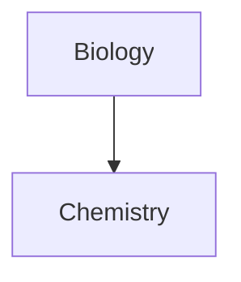

# Markdown

Obsidian markdown format list.
It is slightly difference from Github markdown style.

### Headers

Code:
````
# This is a heading 1 
## This is a heading 2 
### This is a heading 3 
#### This is a heading 4 
##### This is a heading 5 
###### This is a heading 6
````
Output:
# This is a heading 1 
## This is a heading 2 
### This is a heading 3 
#### This is a heading 4 
##### This is a heading 5 
###### This is a heading 6

---

### Text format
Code:
````
*This text will be italic* 
_This will also be italic_
**This text will be bold** 
__This will also be bold__
~~Strikethrough~~
==highlight text==
````
Output:

*This text will be italic* 


_This will also be italic_

**This text will be bold** 

__This will also be bold__

~~Strikethrough~~

==highlight text==

---
### Lists
Code:
````
- Item 1 
- Item 2 
 - Item 2a 
 - Item 2b 

1. Item 1 
1. Item 2 
1. Item 3 
　1. Item 3a 
　1. Item 3b
````
Output:
- Item 1 
- Item 2 
  - Item 2a 
  - Item 2b 

1. Item 1 
1. Item 2 
1. Item 3 
　1. Item 3a 
　1. Item 3b

---

### Images

Code:
````

````
Output:


#### Resizing images
Code:
````

````
Output:


---

### Links 

#### External links
Code:
````
https://en.wikipedia.org/wiki/Main_Page

[wikipedia](https://en.wikipedia.org/wiki/Main_Page)
````
Output:

https://en.wikipedia.org/wiki/Main_Page

[wikipedia](https://en.wikipedia.org/wiki/Main_Page)

#### Obsidian URI links
Code:
````
[Link to note](../README.md)
````
Output:

[Link to note](../README.md)

#### Escaping
Code:
```md
[Link with space](../Utilities/Useful%20Links.md)
````
Output:

[Link with space](../Utilities/Useful%20Links.md)

---

### Blockquotes

Code:
```md
> Human beings face ever more complex and urgent problems, and their effectiveness in dealing with these problems is a matter that is critical to the stability and continued progress of society. \- Doug Engelbart, 1961
````

Output:

> Human beings face ever more complex and urgent problems, and their effectiveness in dealing with these problems is a matter that is critical to the stability and continued progress of society. \- Doug Engelbart, 1961


### Inline code

Code:
```md
Text inside `backticks` on a line will be formatted like code.
````

Output:

Text inside `backticks` on a line will be formatted like code.


---

### Code blocks

Code:
````
```js
function fancyAlert(arg) {
  if(arg) {
    $.facebox({div:'#foo'})
  }
}
```
````

Output:

```js
function fancyAlert(arg) {
  if(arg) {
    $.facebox({div:'#foo'})
  }
}
```

---
### Task list
Code:
```
- [x] #tags, [links](), **formatting** supported 
- [x] list syntax required (any unordered or ordered list supported) 
- [x] this is a complete item 
- [?] this is also a complete item (works with every character) 
- [ ] this is an incomplete item 
- [ ] tasks can be clicked in Preview to be checked off
```

Output:

- [x] #tags, [links](), **formatting** supported 
- [x] list syntax required (any unordered or ordered list supported) 
- [x] this is a complete item 
- [?] this is also a complete item (works with every character) 
- [ ] this is an incomplete item 
- [ ] tasks can be clicked in Preview to be checked off


---

### Tables
Code:
```
First Header | Second Header 
------------ | ------------ 
Content from cell 1 | Content from cell 2 
Content in the first column | Content in the second column
```

Output:

First Header | Second Header 
------------ | ------------ 
Content from cell 1 | Content from cell 2 
Content in the first column | Content in the second column


#### Tables with justification
Code:
```
Left justified | Right justified 
:----------------|-------------:
contnet1 `:` | content 2
```

Output:

Left justified | Right justified 
:----------------|-------------:
contnet1 `:` | content 2


#### Tables with link & image
Code:
```
Internal Link | External Link  | Image
------------ | ------------ | ------------
[Link to note](../README.md) | [wikipedia](https://en.wikipedia.org/wiki/Main_Page) | ]
```

Output:
Internal Link | External Link  | Image
------------ | ------------ | ------------
[Link to note](../README.md) | [wikipedia](https://en.wikipedia.org/wiki/Main_Page) | ]


---
### Horizontal Bar
Code:
```
*** (stars)
--- (minuses)
___ (underscores)
```

Output:

***
---
___

### Footnotes
Code:
```
Here's a simple footnote,[^1] and here's a longer one.[^bignote]

[^1]: meaningful! 

[^bignote]: Here's one with multiple paragraphs and code. 

	Indent paragraphs to include them in the footnote. 
	
	`{ my code }` 
	
		Add as many paragraphs as you like.
```

Output:

Here's a simple footnote,[^1] and here's a longer one.[^bignote]

[^1]: meaningful! 

[^bignote]: Here's one with multiple paragraphs and code. 

	Indent paragraphs to include them in the footnote. 
	
	`{ my code }` 
	
		Add as many paragraphs as you like.


---
### Comments
Code:
```
Here is some inline comments: %%You can't see this text%% (Can't see it) 

Here is a block comment: 
%% 
It can span 
multiple lines 
%%
```

Output:

Here is some inline comments: %%You can't see this text%% (Can't see it) 

Here is a block comment: 
%% 
It can span 
multiple lines 
%%

---
### Callouts
Code:
```
> [!INFO] 
> Here's a callout block. 
> It supports **markdown** and [Link to note](../README.md).
```

Output:
> [!INFO] 
> Here's a callout block. 
> It supports **markdown** and [Link to note](../README.md).

---
### Diagram 
[Mermaid](https://mermaid-js.github.io/) [a helpful live editor](https://mermaid-js.github.io/mermaid-live-editor).

Code:
````

````

Output:


#### Diagram 2

Code:

````


````

Output:


---
### Math LaTex

Code:
```md
\begin
{equation*} 1 + 2 = 3 
\end{equation*}
````
Output:
$$ 
\begin
{equation*} 1 + 2 = 3 
\end{equation*}$$

Code:
```md
$$\begin{vmatrix}a & b\\ 
c & d 
\end{vmatrix}=ad-bc$$
````
Output:
$$\begin{vmatrix}a & b\\ 
c & d 
\end{vmatrix}=ad-bc$$
